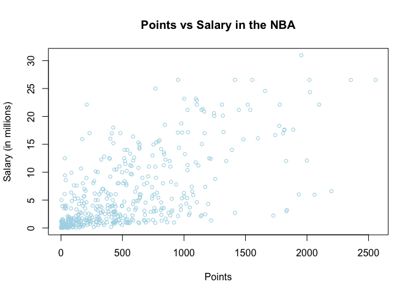
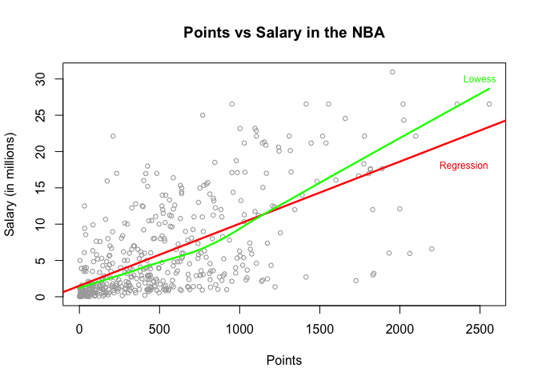
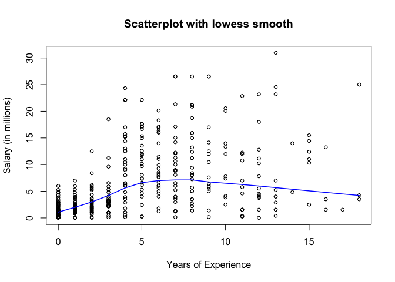
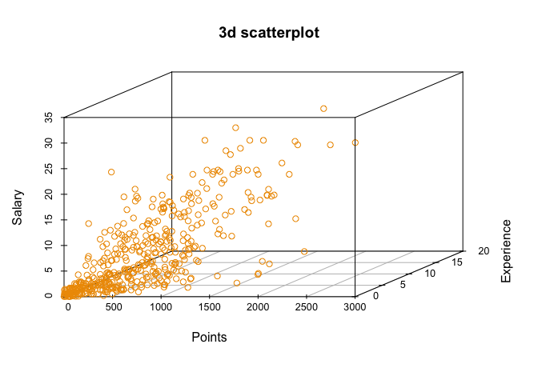
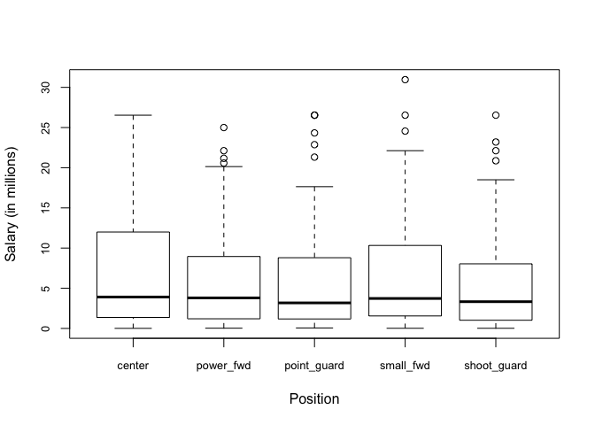

HW01
================
Owen McGrattan
9/21/2017

``` r
# load data file 
load("data/nba2017-salary-points.RData")
```

``` r
# list the available objects 
ls()
```

    ## [1] "experience" "player"     "points"     "points1"    "points2"   
    ## [6] "points3"    "position"   "salary"     "team"

#### 1. Prepping the data

``` r
# reformatting salary to be in terms of millions of dollars

salary <- round(salary / 1000000, digits = 2)
```

``` r
# change rookie "R" character into 0 for experience vector
experience <- as.numeric(replace(x = experience, which(experience == "R"),"0"))
```

``` r
full_pos <- factor(position, labels = c("center", "power_fwd","point_guard","small_fwd","shoot_guard"))

table(full_pos)
```

    ## full_pos
    ##      center   power_fwd point_guard   small_fwd shoot_guard 
    ##          89          89          85          83          95

#### 2. Scatterplot of Points and Salary

``` r
plot(points, salary, xlab = "Points", ylab = "Salary (in millions)", col = "lightblue", pch = 1, cex = 0.75, main = "Points vs Salary in the NBA" )
```



-   Just on a quick glance, there's a strong connection between points scored and salary. As it should be, the players who score more points are paid more points. But this is not a perfectly linear relationship.

-   Based on the high concentration of data points in the lower left-hand corner, it appears the majority of players appear to score fewer than 1000 points and make less than five million. The grouping grows closer and closer as Salary and Points approach 0.

-   There are elite point scorers (around 2000 points scored) who are paid fifteen million or fewer. That most likely is not pure chance that those players are just not being paid more, it most likely reflects the way players in the NBA are paid based on age.

-   As there are players who seem to be underpaid, there are a good number of players who are being paid fifteen million or more and are scoring less than roughly 750 points.

#### 3. Correlation between Points and Salary

``` r
n <- length(player)

mean_x <- sum(points)/n
mean_y <- sum(salary)/n

var_x <- (1/(n-1)) * sum((points - mean_x)^2)
var_y <- (1/(n-1)) * sum((salary - mean_y)^2)

sd_x <- sqrt(var_x)
sd_y <- sqrt(var_y)

cov_xy <- (1/(n-1)) * sum((points-mean_x) * (salary-mean_y))

cor_xy <- cov_xy/(sd_x * sd_y)
```

-   n = 441
-   mean(x) = 546.605442176871
-   mean(y) = 6.18668934240363
-   var(x) = 239136.243970315
-   var(y) = 43.1952440146362
-   sd(x) = 489.015586633305
-   sd(y) = 6.57230888003875
-   cov(xy) = 2046.4244407854
-   cor(xy) = 0.636729609836161

#### 4. Simple Linear Regression

``` r
# first find the slope and intercept of the regression equation 
slope <- cor_xy * (sd_y/sd_x)
intercept <- mean_y - (slope * mean_x)

# and now the predicted values
y_hat <- intercept + slope * points
```

``` r
# summary statistics of the predicted values
summary(y_hat)
```

    ##    Min. 1st Qu.  Median    Mean 3rd Qu.    Max. 
    ##   1.509   2.844   5.206   6.187   8.184  23.400

###### The regression equation:

**y = 1.509076623539 + (0.00855756704550161 \* X)**

-   The slope in the regression equation can be seen as the average change in salary as points changes.
-   The intercept can be seen as the starting point for the regression line, the expected value when the predictor variable (X or points) is 0.

-   0 points: 1.509076623539
-   100 points: 2.36483332808916
-   500 points: 5.78786014628981
-   1000 points: 10.0666436690406
-   2000 points: 18.6242107145422

#### 5. Plotting the regression line

``` r
# carry over scatter of points and salary
plot(points, salary, xlab = "Points", ylab = "Salary (in millions)", col = "darkgrey",pch = 1, cex = 0.75, main = "Points vs Salary in the NBA" )

# plotting the regression line
abline(a = intercept, b = slope, col = "red1", lwd = 2.5)
text(2400, 18, labels = "Regression", col = "red1",cex = 0.75)

# lowess line
lines(lowess(x = points, y = salary), col = "green",lwd = 2.5)
text(2500, 30, labels = "Lowess", col = "green",cex = 0.75)
```



#### 6. Regression residuals and Coefficient of Determination *R*<sup>2</sup>

``` r
# calculate the residuals for the regression line
residuals <- salary - y_hat
# Residual sum of squares
rss <- sum(residuals^2)
# R^2 
tss <- sum((salary - mean_y)^2)
r_2 <- 1 - (rss / tss)
```

``` r
# print out summary statistics for residuals
summary(residuals)
```

    ##    Min. 1st Qu.  Median    Mean 3rd Qu.    Max. 
    ## -14.190  -2.792  -1.095   0.000   2.556  18.810

-   RSS: 11300.4450499872
-   TSS: 19005.9073664399
-   r^2: 0.40542459604211

#### 7. Exploring Position and Experience

``` r
plot(experience, salary, xlab = "Years of Experience", ylab = "Salary (in millions)", main = "Scatterplot with lowess smooth",cex = 0.75, pch = 1)
lines(lowess(experience, salary),col = "blue",lwd = 1.5)
```



``` r
# load 3dscatterplot package
library(scatterplot3d)
```

    ## Warning: package 'scatterplot3d' was built under R version 3.3.2

``` r
#3d scatterplot of salary, experience, and points
scatterplot3d(y = experience, x = points, z = salary, ylab = "Experience", xlab = "Points", zlab = "Salary",main = "3d scatterplot",color = "orange2" )
```



-   The scatterplot shows the 3d positioning of each player with the x variable being points scored, the y variable being years of experience, and the z or vertical variable being the players salary.
-   There appears to be a fairly strong correlation between the three variables. Those who score a lot of points and have a number of years of experience get paid higher amounts of money. The elite scorers in the league, regardless of experience, are paid the highest salaries. There does seem to be a few players who have scored near or at 1500 points, surely above the 75th or 80th percentile.

``` r
# boxplot of salary versus position 
boxplot(salary ~ full_pos, ylab = "Salary (in millions)", cex.axis = 0.8 , xlab = "Position" )
```



-   The boxplot displays the distribution of salaries for the players at each of the five different posiitons.
-   Oddly enough, the medians for each of the positions are roughly the same even though there is not a perfect balance between number of players at each position.

``` r
# display number of players at each position
(table(position))
```

    ## position
    ##  C PF PG SF SG 
    ## 89 89 85 83 95

-   It does appear however that teams are more than willing to spend on some of the more prized centers, but those who are not in the upper tier are paid at or near the minimum.
-   The other four positions have similar spreads with the upper tier guys showing up as outliers.

#### 8. Comments and Reflections

-   This HW was much in line with the material taught in lecture and lab. Visualizing the 3d scatterplot was a little difficult given the fact that it's fairly hard to determine depth in the plot but I can see how it's a helpful tool.
-   The HW took me roughly and hour and a half but I never felt much difficulty going through the problems. I did have some problems trying to get mathematical equaitons to come up with LaTeX, but they eventually worked out in the end. The most time consuming part was writing out the inline code to display my results from the various formulas, but even that didn't take much time.
-   Using functions in R seems very intuitive to me, and writing the code is not difficult. It only comes down to whether or not I know what the function is doing, and the documentation helps answer any questions I might have.
