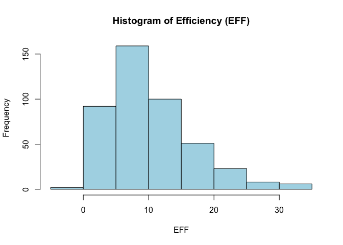
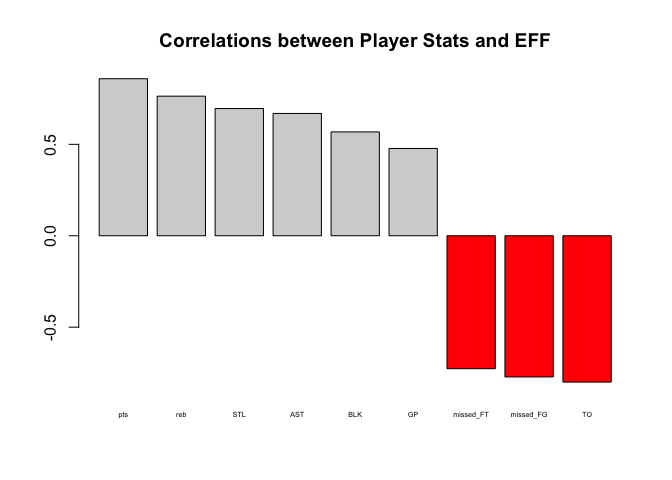
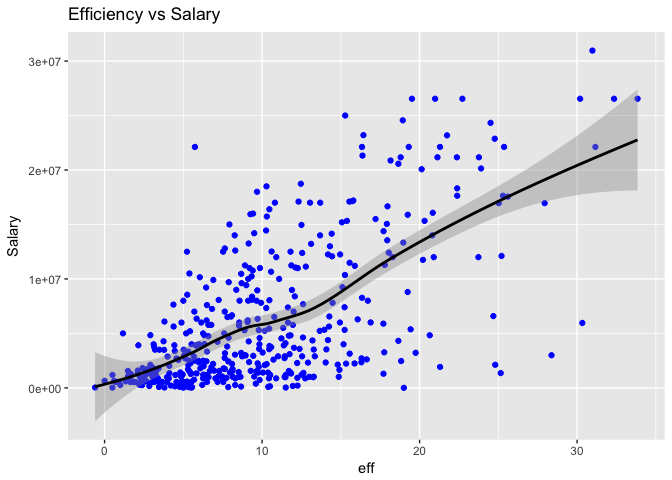
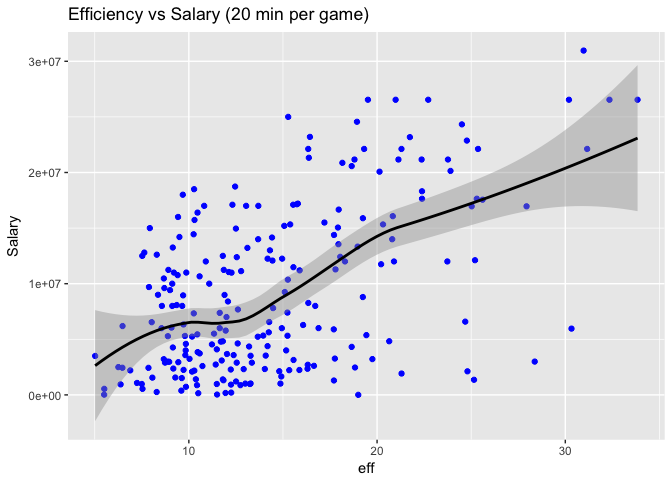

HW02
================
Owen McGrattan
9/30/2017

#### 1. Importing the data

``` r
# practice for both types of data import functions
require(readr)
```

    ## Loading required package: readr

``` r
# read.csv()
nba <- read_csv("~/stat133/stat133-hws-fall17/hw02/data/nba2017-player-statistics.csv", 
    col_types = cols(Position = col_factor(levels = c("C", 
        "PF", "PG", "SG", "SF"))))
str(nba)
```

    ## Classes 'tbl_df', 'tbl' and 'data.frame':    441 obs. of  24 variables:
    ##  $ Player      : chr  "Al Horford" "Amir Johnson" "Avery Bradley" "Demetrius Jackson" ...
    ##  $ Team        : chr  "BOS" "BOS" "BOS" "BOS" ...
    ##  $ Position    : Factor w/ 5 levels "C","PF","PG",..: 1 2 4 3 5 3 5 4 5 2 ...
    ##  $ Experience  : chr  "9" "11" "6" "R" ...
    ##  $ Salary      : num  26540100 12000000 8269663 1450000 1410598 ...
    ##  $ Rank        : int  4 6 5 15 11 1 3 13 8 10 ...
    ##  $ Age         : int  30 29 26 22 31 27 26 21 20 29 ...
    ##  $ GP          : int  68 80 55 5 47 76 72 29 78 78 ...
    ##  $ GS          : int  68 77 55 0 0 76 72 0 20 6 ...
    ##  $ MIN         : int  2193 1608 1835 17 538 2569 2335 220 1341 1232 ...
    ##  $ FGM         : int  379 213 359 3 95 682 333 25 192 114 ...
    ##  $ FGA         : int  801 370 775 4 232 1473 720 58 423 262 ...
    ##  $ Points3     : int  86 27 108 1 39 245 157 12 46 45 ...
    ##  $ Points3_atts: int  242 66 277 1 111 646 394 35 135 130 ...
    ##  $ Points2     : int  293 186 251 2 56 437 176 13 146 69 ...
    ##  $ Points2_atts: int  559 304 498 3 121 827 326 23 288 132 ...
    ##  $ FTM         : int  108 67 68 3 33 590 176 6 85 26 ...
    ##  $ FTA         : int  135 100 93 6 41 649 217 9 124 37 ...
    ##  $ OREB        : int  95 117 65 2 17 43 48 6 45 60 ...
    ##  $ DREB        : int  369 248 269 2 68 162 367 20 175 213 ...
    ##  $ AST         : int  337 140 121 3 33 449 155 4 64 71 ...
    ##  $ STL         : int  52 52 68 0 9 70 72 10 35 26 ...
    ##  $ BLK         : int  87 62 11 0 7 13 23 2 18 17 ...
    ##  $ TO          : int  116 77 88 0 25 210 79 4 68 39 ...
    ##  - attr(*, "spec")=List of 2
    ##   ..$ cols   :List of 24
    ##   .. ..$ Player      : list()
    ##   .. .. ..- attr(*, "class")= chr  "collector_character" "collector"
    ##   .. ..$ Team        : list()
    ##   .. .. ..- attr(*, "class")= chr  "collector_character" "collector"
    ##   .. ..$ Position    :List of 2
    ##   .. .. ..$ levels : chr  "C" "PF" "PG" "SG" ...
    ##   .. .. ..$ ordered: logi FALSE
    ##   .. .. ..- attr(*, "class")= chr  "collector_factor" "collector"
    ##   .. ..$ Experience  : list()
    ##   .. .. ..- attr(*, "class")= chr  "collector_character" "collector"
    ##   .. ..$ Salary      : list()
    ##   .. .. ..- attr(*, "class")= chr  "collector_double" "collector"
    ##   .. ..$ Rank        : list()
    ##   .. .. ..- attr(*, "class")= chr  "collector_integer" "collector"
    ##   .. ..$ Age         : list()
    ##   .. .. ..- attr(*, "class")= chr  "collector_integer" "collector"
    ##   .. ..$ GP          : list()
    ##   .. .. ..- attr(*, "class")= chr  "collector_integer" "collector"
    ##   .. ..$ GS          : list()
    ##   .. .. ..- attr(*, "class")= chr  "collector_integer" "collector"
    ##   .. ..$ MIN         : list()
    ##   .. .. ..- attr(*, "class")= chr  "collector_integer" "collector"
    ##   .. ..$ FGM         : list()
    ##   .. .. ..- attr(*, "class")= chr  "collector_integer" "collector"
    ##   .. ..$ FGA         : list()
    ##   .. .. ..- attr(*, "class")= chr  "collector_integer" "collector"
    ##   .. ..$ Points3     : list()
    ##   .. .. ..- attr(*, "class")= chr  "collector_integer" "collector"
    ##   .. ..$ Points3_atts: list()
    ##   .. .. ..- attr(*, "class")= chr  "collector_integer" "collector"
    ##   .. ..$ Points2     : list()
    ##   .. .. ..- attr(*, "class")= chr  "collector_integer" "collector"
    ##   .. ..$ Points2_atts: list()
    ##   .. .. ..- attr(*, "class")= chr  "collector_integer" "collector"
    ##   .. ..$ FTM         : list()
    ##   .. .. ..- attr(*, "class")= chr  "collector_integer" "collector"
    ##   .. ..$ FTA         : list()
    ##   .. .. ..- attr(*, "class")= chr  "collector_integer" "collector"
    ##   .. ..$ OREB        : list()
    ##   .. .. ..- attr(*, "class")= chr  "collector_integer" "collector"
    ##   .. ..$ DREB        : list()
    ##   .. .. ..- attr(*, "class")= chr  "collector_integer" "collector"
    ##   .. ..$ AST         : list()
    ##   .. .. ..- attr(*, "class")= chr  "collector_integer" "collector"
    ##   .. ..$ STL         : list()
    ##   .. .. ..- attr(*, "class")= chr  "collector_integer" "collector"
    ##   .. ..$ BLK         : list()
    ##   .. .. ..- attr(*, "class")= chr  "collector_integer" "collector"
    ##   .. ..$ TO          : list()
    ##   .. .. ..- attr(*, "class")= chr  "collector_integer" "collector"
    ##   ..$ default: list()
    ##   .. ..- attr(*, "class")= chr  "collector_guess" "collector"
    ##   ..- attr(*, "class")= chr "col_spec"

``` r
# read_csv()
nba_2 <- read.csv("~/stat133/stat133-hws-fall17/hw02/data/nba2017-player-statistics.csv",colClasses = c("character","character","factor","character","double","integer","integer","integer","integer","integer","integer","integer","integer","integer","integer","integer","integer","integer","integer","integer","integer","integer","integer","integer"))
str(nba_2)
```

    ## 'data.frame':    441 obs. of  24 variables:
    ##  $ Player      : chr  "Al Horford" "Amir Johnson" "Avery Bradley" "Demetrius Jackson" ...
    ##  $ Team        : chr  "BOS" "BOS" "BOS" "BOS" ...
    ##  $ Position    : Factor w/ 5 levels "C","PF","PG",..: 1 2 5 3 4 3 4 5 4 2 ...
    ##  $ Experience  : chr  "9" "11" "6" "R" ...
    ##  $ Salary      : num  26540100 12000000 8269663 1450000 1410598 ...
    ##  $ Rank        : int  4 6 5 15 11 1 3 13 8 10 ...
    ##  $ Age         : int  30 29 26 22 31 27 26 21 20 29 ...
    ##  $ GP          : int  68 80 55 5 47 76 72 29 78 78 ...
    ##  $ GS          : int  68 77 55 0 0 76 72 0 20 6 ...
    ##  $ MIN         : int  2193 1608 1835 17 538 2569 2335 220 1341 1232 ...
    ##  $ FGM         : int  379 213 359 3 95 682 333 25 192 114 ...
    ##  $ FGA         : int  801 370 775 4 232 1473 720 58 423 262 ...
    ##  $ Points3     : int  86 27 108 1 39 245 157 12 46 45 ...
    ##  $ Points3_atts: int  242 66 277 1 111 646 394 35 135 130 ...
    ##  $ Points2     : int  293 186 251 2 56 437 176 13 146 69 ...
    ##  $ Points2_atts: int  559 304 498 3 121 827 326 23 288 132 ...
    ##  $ FTM         : int  108 67 68 3 33 590 176 6 85 26 ...
    ##  $ FTA         : int  135 100 93 6 41 649 217 9 124 37 ...
    ##  $ OREB        : int  95 117 65 2 17 43 48 6 45 60 ...
    ##  $ DREB        : int  369 248 269 2 68 162 367 20 175 213 ...
    ##  $ AST         : int  337 140 121 3 33 449 155 4 64 71 ...
    ##  $ STL         : int  52 52 68 0 9 70 72 10 35 26 ...
    ##  $ BLK         : int  87 62 11 0 7 13 23 2 18 17 ...
    ##  $ TO          : int  116 77 88 0 25 210 79 4 68 39 ...

#### 2. Cleaning up some data

``` r
# change the experience vector into a numeric one, replacing "R" with 0

nba$Experience <- as.numeric(gsub("R","0",nba$Experience))
```

#### 3. Player Performance

``` r
# create variables to help make EFF
nba$missed_FG <- nba$FGA - nba$FGM
nba$missed_FT <- nba$FTA - nba$FTM

nba$pts <- (nba$Points3*3) + (nba$Points2 *2) + (nba$FTM)

nba$reb <- nba$OREB + nba$DREB

nba$mpg <- nba$MIN/nba$GP
```

``` r
# calculate EFF
nba$eff <- (nba$pts + nba$reb + nba$AST + nba$STL + nba$BLK - nba$missed_FG - nba$missed_FT - nba$TO) / nba$GP

summary(nba$eff)
```

    ##    Min. 1st Qu.  Median    Mean 3rd Qu.    Max. 
    ##  -0.600   5.452   9.090  10.140  13.250  33.840

``` r
# create a hist to see the distribution of eff
hist(nba$eff, main = "Histogram of Efficiency (EFF)",xlab = "EFF", col = "lightblue")
```



``` r
# bring up dplyr to provide a list of the best players
require(dplyr)
```

    ## Loading required package: dplyr

    ## 
    ## Attaching package: 'dplyr'

    ## The following objects are masked from 'package:stats':
    ## 
    ##     filter, lag

    ## The following objects are masked from 'package:base':
    ## 
    ##     intersect, setdiff, setequal, union

``` r
slice(arrange(select(nba,Player, Team, Salary, eff),desc(eff)),1:10)
```

    ## # A tibble: 10 × 4
    ##                   Player  Team   Salary      eff
    ##                    <chr> <chr>    <dbl>    <dbl>
    ## 1      Russell Westbrook   OKC 26540100 33.83951
    ## 2           James Harden   HOU 26540100 32.34568
    ## 3          Anthony Davis   NOP 22116750 31.16000
    ## 4           LeBron James   CLE 30963450 30.97297
    ## 5     Karl-Anthony Towns   MIN  5960160 30.32927
    ## 6           Kevin Durant   GSW 26540100 30.19355
    ## 7  Giannis Antetokounmpo   MIL  2995421 28.37500
    ## 8       DeMarcus Cousins   NOP 16957900 27.94118
    ## 9           Jimmy Butler   CHI 17552209 25.60526
    ## 10      Hassan Whiteside   MIA 22116750 25.36364

``` r
#give the names of players with negative EFF
select(filter(nba,eff < 0),Player)
```

    ## # A tibble: 1 × 1
    ##            Player
    ##             <chr>
    ## 1 Patricio Garino

``` r
# set up a data frame with only the selected variables
dum <- select(nba, eff, pts,reb, AST, STL, BLK, GP, missed_FG, missed_FT, TO)
cor(dum)
```

    ##                 eff       pts       reb       AST       STL       BLK
    ## eff       1.0000000 0.8588644 0.7634501 0.6689232 0.6957286 0.5679571
    ## pts       0.8588644 1.0000000 0.6901090 0.7390987 0.7670844 0.4702413
    ## reb       0.7634501 0.6901090 1.0000000 0.4081319 0.6152422 0.7823119
    ## AST       0.6689232 0.7390987 0.4081319 1.0000000 0.7651863 0.1893963
    ## STL       0.6957286 0.7670844 0.6152422 0.7651863 1.0000000 0.4121811
    ## BLK       0.5679571 0.4702413 0.7823119 0.1893963 0.4121811 1.0000000
    ## GP        0.4773648 0.6793895 0.6628259 0.5293493 0.7083957 0.4971806
    ## missed_FG 0.7722477 0.9669582 0.5980361 0.7541058 0.7789841 0.3666238
    ## missed_FT 0.7271456 0.7056279 0.8081668 0.4899267 0.5851492 0.6602171
    ## TO        0.8003289 0.8880285 0.6549046 0.8826801 0.7919896 0.4254716
    ##                  GP missed_FG missed_FT        TO
    ## eff       0.4773648 0.7722477 0.7271456 0.8003289
    ## pts       0.6793895 0.9669582 0.7056279 0.8880285
    ## reb       0.6628259 0.5980361 0.8081668 0.6549046
    ## AST       0.5293493 0.7541058 0.4899267 0.8826801
    ## STL       0.7083957 0.7789841 0.5851492 0.7919896
    ## BLK       0.4971806 0.3666238 0.6602171 0.4254716
    ## GP        1.0000000 0.6968926 0.5267104 0.6474272
    ## missed_FG 0.6968926 1.0000000 0.6019304 0.8734628
    ## missed_FT 0.5267104 0.6019304 1.0000000 0.7134837
    ## TO        0.6474272 0.8734628 0.7134837 1.0000000

``` r
#list correlations in decreasing order
sort(cor(dum)[,1],decreasing = TRUE)
```

    ##       eff       pts        TO missed_FG       reb missed_FT       STL 
    ## 1.0000000 0.8588644 0.8003289 0.7722477 0.7634501 0.7271456 0.6957286 
    ##       AST       BLK        GP 
    ## 0.6689232 0.5679571 0.4773648

``` r
vec <- cor(dum)
cors <- (vec[,1])[2:10]
cors[7:10] <- -cors[7:10]
cors <- sort(cors, decreasing = TRUE)
barplot(height = cors,cex.names = 0.45, main = "Correlations between Player Stats and EFF", col = c("lightgray","lightgray","lightgray","lightgray","lightgray","lightgray","red","red","red"))
```



#### 4. Efficiency and Salary

``` r
# create a scatterplot between efficiency and salary with loess line
require(ggplot2)
```

    ## Loading required package: ggplot2

    ## Warning: package 'ggplot2' was built under R version 3.3.2

``` r
ggplot(nba, aes(eff,Salary))+ geom_point(color = 'blue') + geom_smooth(method = loess,color = 'black') + labs(title = "Efficiency vs Salary")
```



``` r
# correlation between salary and efficiency
cor(nba$Salary,nba$eff)
```

    ## [1] 0.655624

-   A player's salary and efficiency are closely tied together. With a correlation coefficient of 0.655, it makes sense that players with higher efficiencies are paid higher salaries. One big question though comes with years of experience. There are numerous players who have above average efficiencies but are paid much less than they should be.

``` r
# create MPG stat
nba$mpg <- nba$MIN / nba$GP

# checking on established players
players2 <- filter(nba, mpg >= 20)
ggplot(players2, aes(eff,Salary))+ geom_point(color = 'blue') + geom_smooth(method = loess,color = 'black') + labs(title = "Efficiency vs Salary (20 min per game)")
```



``` r
cor(players2$eff, players2$Salary)
```

    ## [1] 0.5367224

-   Surprisingly the correlation between the two variables dropped (0.656 vs 0.537) when looking at the "more established" group of players who play on average 20 minutes per game. The drop could be noise considering the fact that the group shrunk by 210 players, but the difference is not so substantial.

-   The difference still does not address those who most likely do not have much experience in the league but are still very skilled and put up high efficiencies. Looking at the relation between these two variables is slightly flawed and expecting the correlation to line up just as it had in the original data set is also a bit of a stretch.

-   It's also important to note that these salaries are most likely part of contracts that had been established in years prior. Players age and regress with variation in their year-to-year performance and their salaries will most likely not change midway through their contract. I am sure that the correlation between salary and career average efficiency is stronger.

#### 5. Reflection

-   Things went smoothly this time around. The only thing that really tripped me up was extracting the individual correlation values, but solving that was gratifying.

-   I would say that this assignment took me longer than the previous one but that was due to more of the setup with the data dictionary, creating a new README file and going through both of the data import functions.

-   I still am not completely used to the functions in the dplyr package, but the functions are so useful and simple it'll be hard to go back to any other way. Very thankful that it was introduced, just wish it was sooner!
