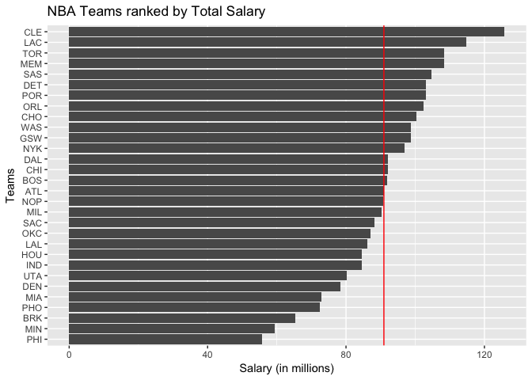
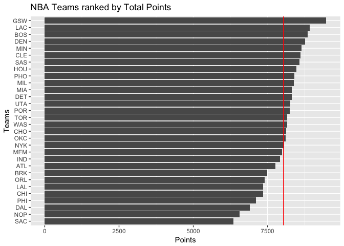
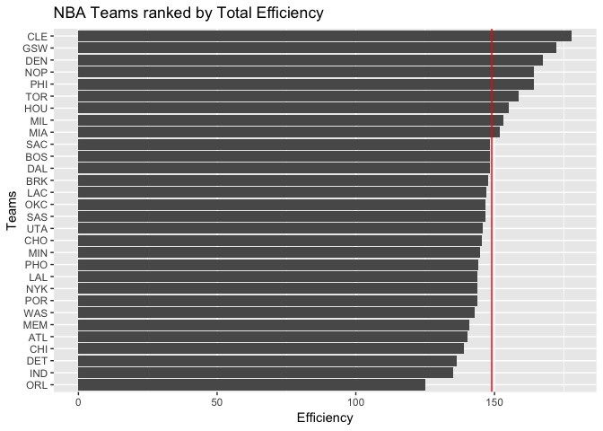
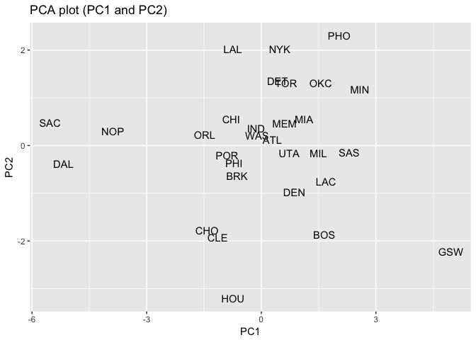
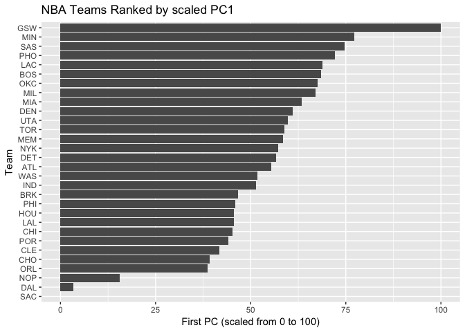

HW03
================
Owen McGrattan
10/7/2017

Ranking of Teams
----------------

``` r
# import teams data, get packages ready
require(readr)
```

    ## Loading required package: readr

``` r
require(ggplot2)
```

    ## Loading required package: ggplot2

    ## Warning: package 'ggplot2' was built under R version 3.3.2

``` r
require(dplyr)
```

    ## Loading required package: dplyr

    ## 
    ## Attaching package: 'dplyr'

    ## The following objects are masked from 'package:stats':
    ## 
    ##     filter, lag

    ## The following objects are masked from 'package:base':
    ## 
    ##     intersect, setdiff, setequal, union

``` r
teams <- read_csv("~/stat133/stat133-hws-fall17/hw03/data/nba2017-teams.csv")
```

    ## Parsed with column specification:
    ## cols(
    ##   team = col_character(),
    ##   experience = col_integer(),
    ##   efficiency = col_double(),
    ##   salary = col_double(),
    ##   points3 = col_integer(),
    ##   points2 = col_integer(),
    ##   free_throws = col_integer(),
    ##   points = col_double(),
    ##   off_rebounds = col_integer(),
    ##   def_rebounds = col_integer(),
    ##   assists = col_integer(),
    ##   steals = col_integer(),
    ##   blocks = col_integer(),
    ##   turnovers = col_integer(),
    ##   fouls = col_integer()
    ## )

``` r
# horiz barplot, teams by salary

ggplot(teams, aes(x = reorder(team, salary), y = salary)) + geom_bar(stat = 'identity') + coord_flip() + geom_hline(yintercept = mean(teams$salary), color = "red") + labs(y = "Salary (in millions)", x = "Teams", title = "NBA Teams ranked by Total Salary")
```



-   There is a pretty wide deviation in salary amongst the teams. Cleveland stands head and shoulders above the rest of the pack with the next lowest team being roughly $10 million less. There is a clear bottom tier of teams, those who spend less than $80 million

``` r
# create horizontal barchart for team points
ggplot(teams, aes(x = reorder(team, points), y = points)) + geom_bar(stat = 'identity') + coord_flip() + geom_hline(yintercept = mean(teams$points), color = "red") + labs(y = "Points", x = "Teams", title = "NBA Teams ranked by Total Points")
```



-   The Warriors stand head and shoulders above the rest of the league when it comes to scoring. There's a steady increase in points but then there's a large jump up to where the Warriors are. Similarly Sacramento stands with New Orleans in the bottom tier.

``` r
# create horizontal barchart for efficiency
ggplot(teams, aes(x = reorder(team, efficiency), y = efficiency)) + geom_bar(stat = 'identity') + coord_flip() + geom_hline(yintercept = mean(teams$efficiency), color = "red") + labs(y = "Efficiency", x = "Teams", title = "NBA Teams ranked by Total Efficiency")
```



-   The range for efficiency is fairly small with the best and worst teams seperated by roughly 50 efficiency. Cleveland and Golden State sit close together at the top while Orlando site far away from the rest of the pack at the bottom.

#### Principal components analysis

``` r
# perform PCA on selected values
pca <- prcomp(~ points3 + points2 + free_throws + off_rebounds + def_rebounds + assists + steals + blocks + turnovers + fouls, data = teams, scale. = TRUE)
```

``` r
# create data frame of eigenvalues
eigs <- data.frame(
  eigenvalue = pca$sdev^2,
  prop = pca$sdev^2 / sum(pca$sdev^2),
  cumprop = cumsum(x = (pca$sdev^2 / sum(pca$sdev^2)))
)
eigs
```

    ##    eigenvalue        prop   cumprop
    ## 1  4.69588631 0.469588631 0.4695886
    ## 2  1.70201009 0.170201009 0.6397896
    ## 3  0.97952464 0.097952464 0.7377421
    ## 4  0.77171938 0.077171938 0.8149140
    ## 5  0.53408824 0.053408824 0.8683229
    ## 6  0.47801622 0.047801622 0.9161245
    ## 7  0.38220374 0.038220374 0.9543449
    ## 8  0.26026243 0.026026243 0.9803711
    ## 9  0.13359274 0.013359274 0.9937304
    ## 10 0.06269622 0.006269622 1.0000000

``` r
# create data frame of team names and PC1 and PC2
pcs <- data.frame(
  teams = teams$team,
  pc1 = pca$x[,1],
  pc2 = pca$x[,2]
)
ggplot(data = pcs, aes(pc1,pc2)) + geom_text(aes(label = pcs$teams)) + labs(x = "PC1", y = "PC2", title = "PCA plot (PC1 and PC2)")
```



``` r
pca$rotation[,c(1,2)]
```

    ##                    PC1         PC2
    ## points3      0.1121782 -0.65652993
    ## points2      0.3601766  0.32892544
    ## free_throws  0.3227564 -0.17651228
    ## off_rebounds 0.3029366  0.35931603
    ## def_rebounds 0.3719432 -0.12808273
    ## assists      0.3125312 -0.44134618
    ## steals       0.3447256 -0.03540585
    ## blocks       0.3162237  0.06131890
    ## turnovers    0.3353958 -0.02169833
    ## fouls        0.3072548  0.28954426

-   Based on the associated weights in PC1 and PC2 the Warriors stand near the top of every category in the league, both those that are positive and those that are negative. The two greatest weights in PC2 (points3 and assists, both negative weights) are an area where the Warriors thrive so they should be expected to produce one of the lower PC2s which they do.

``` r
# create index based on PC1
pcs$scle <- (100 * ((pcs$pc1 - min(pcs$pc1)) / (max(pcs$pc1) - min(pcs$pc1))))

# barchart of rescaled PC1 values
ggplot(pcs, aes(x = reorder(teams, scle), y = scle)) + geom_bar(stat = 'identity') + coord_flip() + labs(y = "First PC (scaled from 0 to 100)", x = "Team", title = "NBA Teams Ranked by scaled PC1")
```



-   With this ranking scaled by PC1 we have a more clear image of the best and worst teams (by PC1). Sacramento is represented in the last position by 0 and the Warriors are in first with their PC1 index of 100. Notably, the Warriors are ahead of the second place team, Minnesota, by a large margin.

#### Comments and Reflection

-   This HW went smoothly but I got stuck on how to interpret the PCA results. Getting the reults was nothing very difficult but explaining them was much more difficult. I hope to do more work with PCA in the future or at least develop a stronger understanding of PCA. Doing the data prep felt tedious and very time consuming but there was nothing that tripped me up on that end.
-   I feel that I'm getting more used to the workflow that goes along with the homeworks, and using relative paths is simple and intuitive.
